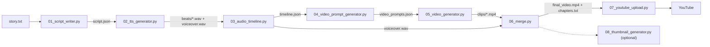

# cosmic_docs_pipeline

**Brahmand Files** — a Quera-style Hindi cinematic documentary pipeline. Audio-first, fully pluggable providers, isolated from the existing `documentary_pipeline/` project.

> If you want to know _why_ each design decision exists, read the four research docs in `docs/` first.

---

## What makes this different

| Axis | Old `documentary_pipeline/` | New `cosmic_docs_pipeline/` |
|---|---|---|
| Orchestration | **Video-first** (fixed 5 s clips → TTS fits later) | **Audio-first** (TTS dictates timing → video generated to match) |
| Sync | Often off by 1-3 s per beat | Per-beat exact to ±50 ms |
| Long beats | Fixed 5 s cap — hard cuts | Auto scene-continuation chains for any provider cap |
| Narrator | Gemini Enceladus (breathy) | Default: **XTTS v2 cloned voice** (offline, free) |
| Providers | Meta AI only | Pluggable: 6 video + 5 TTS + 3 LLM + 4 image |
| Structure | 1 long paragraph → chunks | 7-section spine, sentence-beat JSON |
| Silence | Not trimmed | Aggressive `silenceremove` per beat |

---

## End-to-end data flow



---

## Quick start

```bash
cd cosmic_docs_pipeline

# 1. Python 3.10/3.11 virtual env
python -m venv .venv
source .venv/bin/activate
pip install -r requirements.txt

# 2. Configure
cp .env.example .env
# edit .env — at minimum set GEMINI_API_KEY (or OPENAI_API_KEY / ANTHROPIC_API_KEY)
# For the default OFFLINE FREE stack you also need:
#   - voices/narrator.wav   (10-20 s clean Hindi sample for cloning)
#   - META_AI_DATR + META_AI_ECTO_1_SESS cookies for Meta AI video

# 3. Write one topic line
echo "Kya Shiv Ji ek Alien the? Kailash Parvat ka rahasya" > story.txt

# 4. Run the pipeline stage by stage
python 01_script_writer.py          # → output/<topic>/script.json
python 02_tts_generator.py          # → beats/*.wav + voiceover.wav
python 03_audio_timeline.py         # → timeline.json
python 04_video_prompt_generator.py # → video_prompts.json
python 05_video_generator.py        # → clips/*.mp4  (longest stage)
python 06_merge.py                  # → final_video.mp4 + chapters.txt
python 07_youtube_upload.py --dry-run  # verify title/description
python 07_youtube_upload.py         # actual upload
python 08_thumbnail_generator.py    # optional A/B thumbnails
```

All stages are **idempotent / resumable** — rerunning stage N skips work already completed.

---

## Provider decision table

| Need | TTS pick | Video pick | Total cost |
|---|---|---|---|
| **Start here (free, offline, private)** | `xtts` + `voices/narrator.wav` | `meta_ai` | $0 |
| First paid upgrade (biggest quality jump) | `xtts` | `kling` | ~$20/mo |
| Premium narrator + visuals | `elevenlabs` | `kling` or `sora` | ~$45/mo |
| 4K native output | `elevenlabs` | `veo` | API pay-as-you-go |
| Fast CPU drafts (no cloning) | `piper` | `meta_ai` | $0 |

Switch any axis via one env var:
```
TTS_PROVIDER=xtts        # xtts | piper | gemini | elevenlabs | f5
VIDEO_PROVIDER=meta_ai   # meta_ai | kling | sora | veo | runway | wan
LLM_SELECTED=claude      # claude | gemini | openai
THUMB_PROVIDER=gemini_image  # gemini_image | ideogram | dalle | flux
```

---

## Voice cloning setup (XTTS default)

1. Record **10-20 seconds** of a clean Hindi narration. Use a good mic, quiet room, no music. One speaker.
2. Save as WAV:
   ```bash
   # Example using ffmpeg to trim a sample
   ffmpeg -i raw_sample.m4a -ss 2 -t 15 -ar 24000 -ac 1 voices/narrator.wav
   ```
3. That's it — XTTS picks it up automatically because `TTS_REFERENCE_WAV=voices/narrator.wav` in `.env.example`.
4. Test quickly:
   ```bash
   python 02_tts_generator.py --diagnose "Yeh brahmand hamari kalpana se kahin zyada vishal hai."
   # play output/_diagnose/xtts.wav
   ```

---

## Directory layout

```
cosmic_docs_pipeline/
├── README.md                  ← you are here
├── .env.example               ← copy to .env
├── requirements.txt
├── config.py                  ← all env knobs
├── story.txt                  ← topic (one line)
│
├── docs/
│   ├── quera_research.md           (viral DNA of Quera Official)
│   ├── tts_voice_research.md       (5-provider TTS comparison)
│   ├── video_model_research.md     (6-provider video comparison)
│   ├── channel_playbook.md         (brand + format + cadence)
│   └── launch_kit.md               (10 topics + templates + calendar)
│
├── skills/
│   ├── scriptwriter_skill.md       (LLM skill for 01_script_writer)
│   ├── visuals_skill.md            (LLM skill for 04_video_prompt_generator)
│   └── thumbnail_skill.md          (LLM skill for 08_thumbnail_generator)
│
├── llm_providers/        gemini.py / openai_chat.py / anthropic_claude.py
├── tts_providers/        xtts / piper / gemini / elevenlabs / f5
├── video_providers/      meta_ai / kling / sora / veo / runway / wan
├── utils/                silence_trim.py / ffprobe.py / align_with_whisper.py
├── voices/               place narrator.wav here (10-20 s clean Hindi sample)
│
├── 01_script_writer.py
├── 02_tts_generator.py
├── 03_audio_timeline.py
├── 04_video_prompt_generator.py
├── 05_video_generator.py
├── 06_merge.py
├── 07_youtube_upload.py
├── 08_thumbnail_generator.py   (optional)
│
└── output/<topic>/
    ├── script.json                        (stage 01)
    ├── script.<provider>.json             (per-LLM variant)
    ├── beats/NNN.wav                      (stage 02 trimmed)
    ├── voiceover.wav                      (stage 02 merged)
    ├── timeline.json                      (stage 03)
    ├── video_prompts.json                 (stage 04)
    ├── clips/NNN_MM.mp4 + manifest.json   (stage 05)
    ├── _retimed/                          (stage 06 intermediate)
    ├── video_track.mp4                    (stage 06 intermediate)
    ├── final_video.mp4                    (stage 06)
    ├── chapters.txt                       (stage 06)
    ├── youtube_url.txt                    (stage 07)
    └── thumbnail_a.png / thumbnail_b.png  (stage 08)
```

---

## Common recovery commands

| Situation | Command |
|---|---|
| Regenerate everything from scratch | `rm -rf output/<topic>/` then rerun from stage 01 |
| Re-try only failed clips | `python 05_video_generator.py` (idempotent) |
| Rebuild timeline after silence-trim tuning | Delete `timeline.json` → rerun stage 03 |
| Force re-synthesize all beats | `python 02_tts_generator.py --force` |
| Test a TTS voice fast | `python 02_tts_generator.py --diagnose "sample sentence"` |
| Smoke-test 3 video clips | `python 05_video_generator.py --test-prompts` |
| Preview title / description without uploading | `python 07_youtube_upload.py --dry-run` |

---

## Environment variable cheat-sheet

| Var | Default | Purpose |
|---|---|---|
| `TARGET_MINUTES` | 22 | Script length target |
| `LLM_PROVIDERS` | gemini,openai,claude | Run in parallel for best variant picking |
| `LLM_SELECTED` | claude | Which LLM variant to use for the canonical output |
| `TTS_PROVIDER` | **xtts** | xtts / piper / gemini / elevenlabs / f5 |
| `TTS_REFERENCE_WAV` | voices/narrator.wav | For XTTS / F5 / ElevenLabs cloning |
| `TTS_LANGUAGE` | hi | XTTS language code |
| `SILENCE_TRIM_DURATION` | 0.35 | Trim any silence longer than this (seconds) |
| `SILENCE_TRIM_THRESHOLD_DB` | -38 | Below this dB counts as silence |
| `VIDEO_PROVIDER` | **meta_ai** | meta_ai / kling / sora / veo / runway / wan |
| `VIDEO_MAX_CLIP_SEC` | *(auto)* | Override provider's max |
| `THUMB_PROVIDER` | gemini_image | gemini_image / ideogram / dalle / flux |
| `YOUTUBE_PRIVACY` | private | private / public / unlisted |

---

## Next steps after your first video

1. Read `docs/launch_kit.md` Section 10 — growth targets and 30-day calendar.
2. After 4-5 free-tier videos, decide whether to upgrade to Kling + ElevenLabs.
3. Use `utils/align_with_whisper.py` to generate `.srt` subtitles from `voiceover.wav`.
4. Keep iterating on `voices/narrator.wav` — the single biggest audio-quality lever is a cleaner 20-second reference sample.
